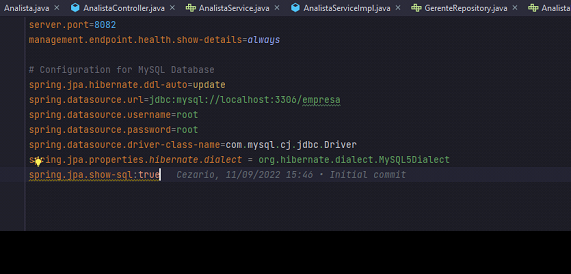

# APS-Desenvolvimento-BANCO-DE-DADOS
APS de DESENVOLVIMENTO DE APLICAÇÕES COM BANCO DE DADOS AV1 e AV2 

# Tecnologia usadas: 
    - jAVA 11
    - Sprint boot
    - MYSQL
    - Meaven

# Como rodar o projeto ?
Para Rodar o projeto tenha java 11 na maquina, e mudar as configurações do arquivo application.properties para fazer a conexao com o seu banco de dados MYSQL.

Fazer a configuração do application.properties com a configuracao do seu banco MYSQL como **senha** e **user**.

Criar uma schema no banco chamado **Empresa** e depois rodar o projeto proque ele vai automaticamente criar as tabelas  por causa do lombok. 